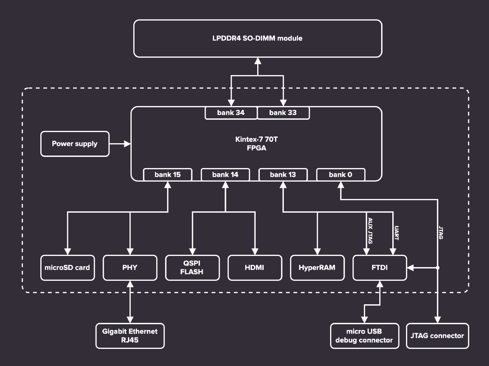

=================
LPDDR4 test board
=================

.. figure:: img/lpddr4-test-board.jpg

Overview
--------

This repository contains open hardware design files for an experimental platform built around Xilinx Kintex-7 FPGA.
The main purpose of this platform is to develop and customize RAM controllers supporting LPDDR4 ICs.
The design files were prepared in KiCad.
This design is now a Work in Progress.

Repository structure
--------------------
The main repository directory contains KiCad PCB project files, a LICENSE and README.
The remaining files are stored in the following directories:

* ``lib`` - contains the component libraries
* ``img`` - contains graphics for this README

Key Features
------------

* Kintex-7 FPGA - XC7K70T-FBG484
* Modular design with custom DDR4 SO-DIMM connector
* HDMI output connector
* Ethernet RJ45 connector with 1GbE transciever
* Micro USB debug connector with FT4232HQ FTDI USB controller
* JTAG
* microSD card slot
* QSPI FLASH memory
* External 7-12V power input
* 5 user LEDs
* 4 user buttons

Block diagram
-------------

